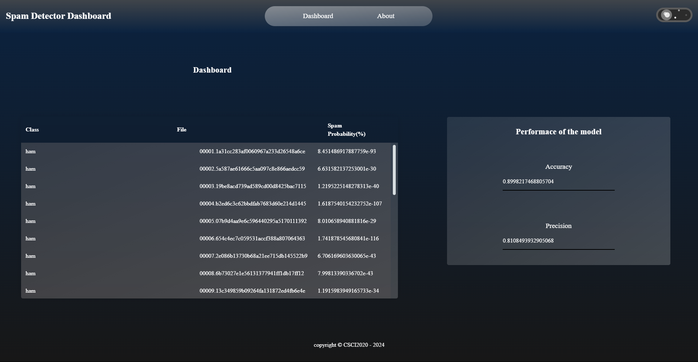

# Assignment 01 - Spam Detector
## Project Information

This project aims to create an efficient spam detector using the unigram approach known as the Naive Bayes Classifier. The program reads and analyzes both spam and authentic emails to build a model that calculates the probability of a file being spam based on how ofter the word appears in spam emails. 

### Screenshot



### Precision and Accuracy Measurements

- Accuracy: 89.98%
- Precision: 81.08%

### Group Members

- Kershan Arulneswaran - Backend (Testing, Training, Responses)
- Haider Saleem - Frontend, Testing part of Backend
- Simon Berhe - FrontEnd, Responses part of Backend
- Smit Kalathia - README.md format and Explanations

## Improvements

In our project, we focused on enhancing both the user interface and the underlying model for better performance. For the user interface, We were able to create a Dark/Light mode feature for the user to chooce. Also, we went for a glass UI to make the website look visually appealing to our users. Lastly, we optimized the user interface for responsiveness, ensuring smooth interaction across various devices and screen sizes. For the backend of this project, we included many features to make it  robust, scalable, and efficient.  We implemented comprehensive data preprocessing techniques to clean and normalize the input email data, Laplace smoothing [1] as part of our backend implementation to address the issue of zero probabilities for unseen words in our training data, and finally, simplified the folder merging process by creating a single function that combines the contents of two folders. This function eliminates the need for repetitive loops to merge each folder individually. If we had more time, we would've implemented logarithmic probabilities[2] because sometimes, the small probabilities would make the exponent variable in P(S|F) really big, which we do not want to have. We tried to do this at the start, but our model did worse when we did that, so allowing us more time to do this will help us implement logs in a more efficient way.

## How to Run

1. Clone the repository using the command:
   ```bash
   git clone https://github.com/OntarioTech-CS-program/w24-csci2020u-assignment01-arulneswaran-berhe-kalathia-saleem
2. Open in IntelliJ IDEA with the folder: /w24-csci2020u-assignment01-arulneswaran-berhe-kalathia-saleem
3. Edit the configuration so that the URL is http://localhost:8080/spamDetector-1.0/api/spam/
4. Run the code and open the index.html file by going to SpamDetectorClient folder
5. Run the html file and wait around 5 seconds for the values to fill up in the table and Precision and Accuracy boxes
   
## Other Resources
Other than the traditional Jakarta EE, Java.io and Math libraries, we didn't use any other dependencies for this project. There are some links about Laplace smoothing and other ways to improve our Naive Bayes algorithm here:

[1] https://towardsdatascience.com/laplace-smoothing-in-naïve-bayes-algorithm-9c237a8bdece

[2] https://www.baeldung.com/cs/naive-bayes-classification-performance
